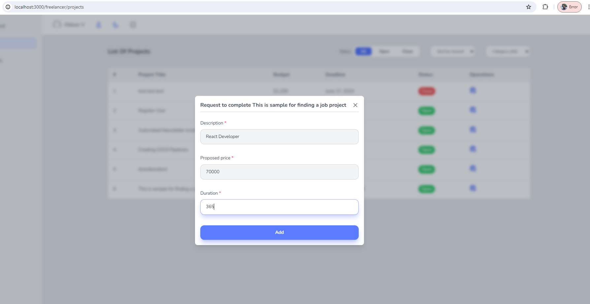

# CodeLance: Full-Stack Freelancing Platform (Capstone Project)

## Project Overview
This project is a web application where users with employer roles can create various projects for freelancer users to submit proposals. An admin user can monitor all these activities and control access permissions for other users.

## Frontend Development
The frontend is developed using React.js with Tailwind CSS for styling. For state management, I implemented:
- Context API for local state management
- TanStack Query (formerly React Query) for remote state management and data fetching
- React Hook Form for form validation and handling

## Authentication & Authorization
The platform features a comprehensive user management system:
- Authentication via mobile number and OTP verification
- Role-based authorization system with three distinct roles:
  - Admin: Full system oversight and user management
  - Freelancer: Browse projects and submit proposals
  - Owner (Employer): Create projects and review proposals

## Key Features
- Project creation and management for employers
- Proposal submission system for freelancers
- Admin dashboard for monitoring platform activities
- User role management and access control
- Secure authentication with OTP verification
- Responsive design for all device types

## Technical Implementation
The architecture follows modern React practices with component-based design, custom hooks, and efficient state management patterns to ensure optimal performance and scalability.

# Live Website: 

### Deployed on Vercel: https://codelance-mern-front-jd6mapdm3-abbas-projects-d1e5aa36.vercel.app/

# Demo

When we click on one of the links on the main page , we are redirected to the "auth" page, which is the login page. In this project, I have used the Twilio API to send and validate one-time password(OTP) via SMS to a specified mobile number, you can use the Twilio API. You should first verify a number that you own to use it as the 'To' number for outbound messages from the Sandbox Number.

Register User:
Enter your Phone Number:

A toast message confirms that the one-time password has been sent to the entered mobile number. After entering it, click Verify. Be aware that if it takes more than 90 seconds, the sent code will expire, and you will need to click the Resend OTP link that appears after 90 seconds instead of the countdown timer.  

Displaying the addition of a user in MongoDB  

After 90 seconds, I entered the code and encountered an error message stating that the code has expired. As instructed, I clicked on the "Re-send OTP" link, received the new code, and entered it. 

After entering a valid code, you will be redirected to the next page where you need to enter your name, email, and role (either freelancer or owner). 

At this stage, the value of isVerifiedPhoneNumber in the database changes from false to true, but isActive remains false until the user provides more complete information along with their role on this website and as you can see in the picture, until the role is determined, I have considered everyone's role as "USER" by default. 

After entering your details and role, click on "Verify User" 

As you can see, Now your information has been completed successfully but your profile is pendig approval. Now, we need to wait for the admin to log into their user panel and approve the user in the relevant section.  

In the image below, you can see the database up to this stage where after role determination, isActive changes from false to true, the role changes from USER to FREELANCER, and the fields email and name are also added. However, until the admin approves the user, its status remains at the default value of 1. In this database, 1 signifies Pending Approval, 0 signifies Rejected, and 2 signifies Approved.  

Here, the user Fahimeh logs into her admin panel. You see the statistics page displaying the number of users, projects, and proposals.  

Enter the users section, find the user who has recently joined the site, and click on "Change Status".  

Here, after clicking on "Change Status" and styling with a modal popup, a window appears. By clicking on the cross (close) symbol or clicking anywhere outside the box, you can close the window and cancel the operation. Alternatively, by selecting one of the three status options, you can specify the user's status.  
<h6>I have written this custom hook for the backdrop and used it in various contexts such as clicking on edit, delete, or changing proposal status.</h6>

The status of the new user (Abbas) has been changed to "approved".

In the Projects section, the admin has access to view all projects created by all owners.  

In the Proposals section, The admin has access to view all Proposals created by all Freelancer.  

Once the user approved by the admin, whose status in the database has changed from 1 to 2 indicating approval, logs in again, they are greeted with a welcome message and gain access to their dashboard as a freelancer. << In the displayed message, I should change the old name "FreelanceHub" to the new name "CodeLance". >>  

In the Projects section the Freelancer has access to view all projects created by all employers.  

The freelancer can only see the proposals that they themselves have proposed in their proposals section, along with the status of each proposal. (whether the Owner has approved it or not)  

Now we want to log in to the website with owner access and see the permissions an owner has. The owner can see a brief summary of their statistics, including the number of projects, the number of assigned projects, and the number of proposals that freelancers have proposed for their projects.  

In the Projects section, each Owner can only see the projects they have created, unlike the admin and freelancers who can see all projects. Here, the Owner can create a new project, edit, or delete a project. The Owner can change the status of a project to open or close and can also view the proposals for each of their projects.

The owner can add a new project by clicking on Add Project.

When you click on Delete Project, a project deletion confirmation window opens as a backdrop. By clicking on Delete, the project is removed.

By clicking on one of the proposals for a project that has not been assigned, we want to check if any requests have been submitted for this project.

Here we see that two freelancers have submitted proposals for this project. Their status is set to "Pending Approval" by default. The owner needs to review these proposals and approve one based on their requirements.

After making a decision and selecting one of the proposals, the owner clicks on the "Change Status" link for the chosen proposal. As with previous similar actions, the owner selects one of the available options.

After approving one of the proposals, its status is updated in the database, and a success message is displayed as a notification.

Now, when we return to the previous page listing the owner's projects, we observe that the freelancer field is no longer empty (null); the approved freelancer has been assigned to the project.

Now, if you check the freelancer's dashboard, you will see that one more proposal has been approved, and it's wallet has been updated as well.

The freelancer wants to submit a new proposal for a project recently added by the owner. By clicking on the operation link, a backdrop window opens.

The freelancer can submit their proposal for this project, specifying their asking price and the estimated time to complete the project.

With the addition of a new proposal, which is by default set to pending approval, the freelancer can see it in their proposals section to stay updated on the status of their request. The freelancer waits for the owner to approve it.

Now the owner can see the new proposal in their projects section by clicking on the proposals link for the specific project in their control panel and change its status accordingly.

Another feature of this project, which can be easily implemented using Tailwind CSS, is the ability to switch the theme from the default light mode to dark mode.

The freelancer can use the filter feature for existing projects. They can apply filters based on project status, category, and sort the results from oldest to newest or vice versa.

In the end, I want to demonstrate that this project uses two cookies named accessToken and refreshToken. These tokens are uniquely generated based on each user's ID and are unique for each user regardless of their role. The accessToken expires after 24 hours, while the refreshToken expires after one year. By providing these cookies, the backend ensures the authenticity and access levels of users with different roles and IDs to various parts of the application. For example, a user with the freelancer role cannot access admin or owner-level permissions.  
<h5>JavaScript can retrieve cookies from websites, it is restricted from accessing cookies with the HttpOnly, which are accessible on the server-side. It's very secure</h5>

## Node Package Managers used in this project:
- npm create vite@latest
- npm i tailwind
- npm i react-router-dom@latest
- npm i react-icons react-otp-input
- npm i axios
- npm i @tanstack/react-query
- npm i react-hot-toast
- npm i react-loader-spinner
- npm i react-hook-form
- npm i react-tag-input-component
- npm i react-multi-date-picker
- npm i -D @tailwindcss/forms
- npm i @headlessui/react
  

One of my favorite projects was CodeLance, a full-stack freelancing platform I developed as my Capstone Project during my Post-Graduate Certificate in Web Development at Humber College.
This project is particularly special to me because it allowed me to fully utilize the MERN stack—React for the frontend, Node.js and Express for the backend, and MongoDB as the database. I implemented JWT authentication with a secure token-based authentication system using Access Tokens and Refresh Tokens, which enhanced security and ensured seamless user sessions. I also used OTP-based user verification for an additional layer of security.
What I loved most about this project was the opportunity to design end-to-end workflows, including project posting, proposal submission, and messaging between employers and freelancers. It challenged me to think about scalable architecture, complex data relationships, and user-centered design, which deepened my understanding of full-stack development.
Additionally, seeing the platform bring users together for seamless collaboration was incredibly rewarding. It wasn’t just about building a functional app; it was about creating an intuitive and meaningful user experience.
This project reinforced my passion for MERN stack development and solidified my commitment to building scalable, user-centered applications. It was a great learning experience that demonstrated the impact of well-designed digital solutions on user interaction and engagement.
