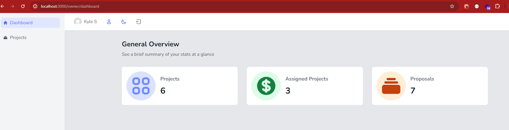
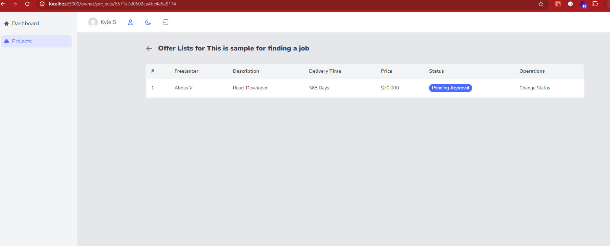

# CodeLance

DevLance is a web platform designed to connect employers with skilled freelancers for project collaboration.

# Live Website: 

### Deploy on Vercel: https://codelance-mern-front-jd6mapdm3-abbas-projects-d1e5aa36.vercel.app/


# Demo

When we click on one of the links on the main page (image above), we are redirected to the "auth" page, which is the login page. In this project, I have used the Twilio API to send and validate one-time password(OTP) via SMS to a specified mobile number, you can use the Twilio API. You should first verify a number that you own to use it as the 'To' number for outbound messages from the Sandbox Number.


- Sign Up for Twilio:

    Go to Twilio and create an account.
    Get your Twilio Account SID, Auth Token, and a Twilio phone number.

- Install Twilio SDK:
    Install the Twilio Node.js package by running:
```
npm install twilio
```

Enter your Phone Number:


A toast message confirms that the one-time password has been sent to the entered mobile number. After entering it, click Verify. Be aware that if it takes more than 90 seconds, the sent code will expire, and you will need to click the Resend OTP link that appears after 90 seconds instead of the countdown timer. <br>


Displaying the addition of a user in MongoDB <br>


After 90 seconds, I entered the code and encountered an error message stating that the code has expired. As instructed, I clicked on the "Re-send OTP" link, received the new code, and entered it.<br>


After entering a valid code, you will be redirected to the next page where you need to enter your name, email, and role (either freelancer or owner).<br>


At this stage, the value of isVerifiedPhoneNumber in the database changes from false to true, but isActive remains false until the user provides more complete information along with their role on this website and as you can see in the picture, until the role is determined, I have considered everyone's role as "USER" by default.<br>


After entering your details and role, click on "Verify User"<br>


As you can see, Now your information has been completed successfully but your profile is pendig approval. Now, we need to wait for the admin to log into their user panel and approve the user in the relevant section. <br>


In the image below, you can see the database up to this stage where after role determination, isActive changes from false to true, the role changes from USER to FREELANCER, and the fields email and name are also added. However, until the admin approves the user, its status remains at the default value of 1. In this database, 1 signifies Pending Approval, 0 signifies Rejected, and 2 signifies Approved. <br>


Here, the user Fahimeh logs into her admin panel. You see the statistics page displaying the number of users, projects, and proposals. <br>


Enter the users section, find the user who has recently joined the site, and click on "Change Status. <br>








